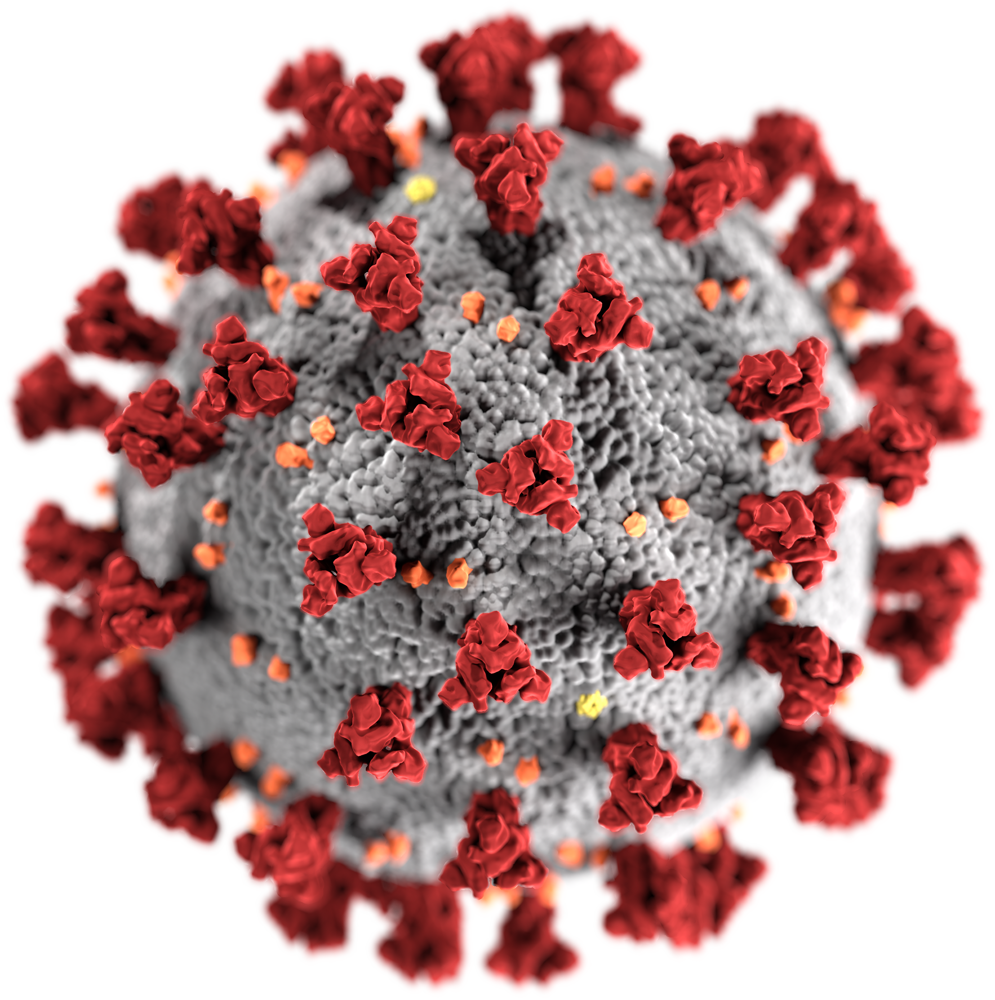

[![Contributors][contributors-shield]][contributors-url]
[![Forks][forks-shield]][forks-url]
[![Stargazers][stars-shield]][stars-url]
[![Issues][issues-shield]][issues-url]
[![MIT License][license-shield]][license-url]
[![LinkedIn][linkedin-shield]][linkedin-url]

<!-- PROJECT LOGO -->
<br />
<p align="center">
  <a href="https://github.com/manningb/covid-19-cdc-machine-learning-data-analysis">
    
  </a>

  <h3 align="center">Covid-19 CDC Exploratory Data Analysis</h3>

  <p align="center">
    Exploratory Analysis, Data Cleaning and Machine Learning modelling using Pandas, Matplotlib and Sklearn.
    <br />
    <a href="https://github.com/manningb/covid-19-cdc-machine-learning-data-analysis"><strong>Explore the docs »</strong></a>
    <br />
    <br />
    <a href="https://github.com/manningb/covid-19-cdc-machine-learning-data-analysis/blob/main/1_cleaning_exploratory_analysis/1_2020-Homework2-Notebook-DataCleaning-FeatureCreation.ipynb">Exploratory Analysis Notebook</a>
    ·
	<a href="https://github.com/manningb/covid-19-cdc-machine-learning-data-analysis/blob/main/2_machine_learning_modelling/2_2020-Homework2-Notebook.ipynb">Machine Learning Notebook</a>
    ·
    <a href="https://github.com/manningb/covid-19-cdc-machine-learning-data-analysis/issues">Report Bug</a>
    ·
    <a href="https://github.com/manningb/covid-19-cdc-machine-learning-data-analysis/issues">Request Feature</a>
  </p>
</p>

<!-- TABLE OF CONTENTS -->
<details open="open">
  <summary><h2 style="display: inline-block">Table of Contents</h2></summary>
  <ol>
    <li>
      <a href="#about-the-project">About The Project</a>
      <ul>
        <li><a href="#built-with">Built With</a></li>
      </ul>
    </li>
    <li>
      <a href="#getting-started">Getting Started</a>
      <ul>
        <li><a href="#prerequisites">Prerequisites</a></li>
        <li><a href="#installation">Installation</a></li>
      </ul>
    </li>
    <li><a href="#usage">Usage</a></li>
    <!-- <li><a href="#roadmap">Roadmap</a></li> -->
    <li><a href="#contributing">Contributing</a></li>
    <li><a href="#license">License</a></li>
    <li><a href="#contact">Contact</a></li>
    <!-- <li><a href="#acknowledgements">Acknowledgements</a></li> -->
  </ol>
</details>

<!-- ABOUT THE PROJECT -->

## About The Project

In this main directory you will find the following: - 1_Homework1: This contains my corrections from Homework 1, I have added in a number of new features here which are then used throughout Homework 2.
Most of this file is same apart from the very last section where the new features are added and evaluated using correlation coefficients - 2_Homework2: This contains my work for Homework 2. - data: - covid19-cdc-17324576-clean-new-features.csv - Used from the start of Homework 2 to test Linear Regression, Logistic Regression and Random Forests - covid19-cdc-17324576-for-part-5.csv - Used for Part 5 to evaluate if more features would be better - it does not contain the feature scaling for time since start used in the above dataset - 24032021-covid19-cdc-deathyn-recent-10k.csv - New dataset for testing part 5 - trees: Contains various tree files for presentation in the notebook. - confusion_matrix.py: This was adapted from code found online to quickly generate a confusion matrix and metrics based on predicted and actual data - 2_2020-Homework2-Notebook.ipynb: Homework 2 notebook - pickle: Pickle Randomised Search results

### Built With

- [Python](https://github.com/python)
- [Pandas](https://github.com/pandas-dev/pandas)
- [Matplotlib](https://github.com/matplotlib/matplotlib)
- [Sklearn](https://github.com/scikit-learn/scikit-learn)
- [Jupyter Notebooks](https://github.com/jupyter/notebook)

<!-- GETTING STARTED -->

## Getting Started

To get a local copy up and running follow these simple steps.

### Installation

1. Clone the repo
   ```sh
   git clone https://github.com/manningb/covid-19-cdc-machine-learning-data-analysis.git
   ```
2. Install Python packages
   ```sh
   pip install -r requirements.txt
   ```

<!-- USAGE EXAMPLES -->

<!-- ## Usage

Use this space to show useful examples of how a project can be used. Additional screenshots, code examples and demos work well in this space. You may also link to more resources.

_For more examples, please refer to the [Documentation](https://example.com)_ -->

<!-- ROADMAP -->

<!-- ## Roadmap

See the [open issues](https://github.com/manningb/covid-19-cdc-machine-learning-data-analysis/issues) for a list of proposed features (and known issues). -->

<!-- CONTRIBUTING -->

## Contributing

Contributions are what make the open source community such an amazing place to be learn, inspire, and create. Any contributions you make are **greatly appreciated**.

1. Fork the Project
2. Create your Feature Branch (`git checkout -b feature/AmazingFeature`)
3. Commit your Changes (`git commit -m 'Add some AmazingFeature'`)
4. Push to the Branch (`git push origin feature/AmazingFeature`)
5. Open a Pull Request

<!-- LICENSE -->

## License

Distributed under the MIT License. See `LICENSE` for more information.

<!-- CONTACT -->

## Contact

Brian Manning - manningbrian98@gmail.com

Project Link: [https://github.com/manningb/covid-19-cdc-machine-learning-data-analysis](https://github.com/manningb/covid-19-cdc-machine-learning-data-analysis)

<!-- ACKNOWLEDGEMENTS

## Acknowledgements

- []()
- []()
- []() -->

<!-- MARKDOWN LINKS & IMAGES -->
<!-- https://www.markdownguide.org/basic-syntax/#reference-style-links -->

[contributors-shield]: https://img.shields.io/github/contributors/manningb/covid-19-cdc-machine-learning-data-analysis.svg?style=for-the-badge
[contributors-url]: https://github.com/manningb/repo/graphs/contributors
[forks-shield]: https://img.shields.io/github/forks/manningb/covid-19-cdc-machine-learning-data-analysis.svg?style=for-the-badge
[forks-url]: https://github.com/manningb/repo/network/members
[stars-shield]: https://img.shields.io/github/stars/manningb/covid-19-cdc-machine-learning-data-analysis.svg?style=for-the-badge
[stars-url]: https://github.com/manningb/repo/stargazers
[issues-shield]: https://img.shields.io/github/issues/manningb/covid-19-cdc-machine-learning-data-analysis.svg?style=for-the-badge
[issues-url]: https://github.com/manningb/repo/issues
[license-shield]: https://img.shields.io/github/license/manningb/covid-19-cdc-machine-learning-data-analysis.svg?style=for-the-badge
[license-url]: https://github.com/manningb/repo/blob/master/LICENSE.txt
[linkedin-shield]: https://img.shields.io/badge/-LinkedIn-black.svg?style=for-the-badge&logo=linkedin&colorB=555
[linkedin-url]: https://linkedin.com/in/https://www.linkedin.com/in/brianmanningw/
